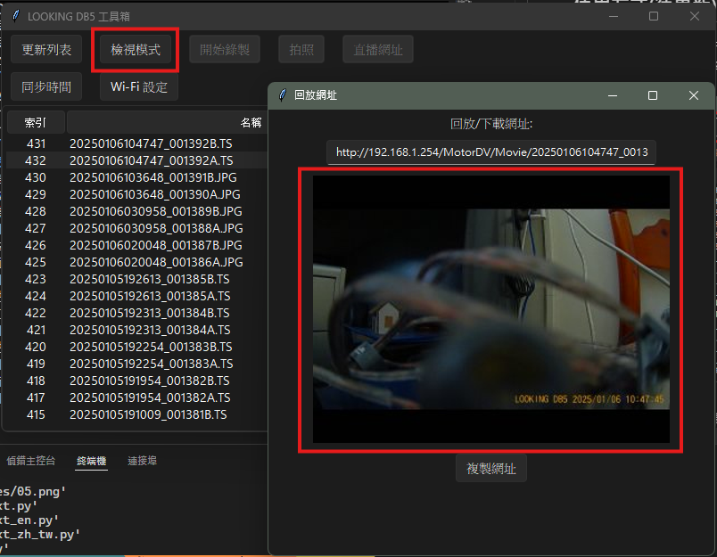
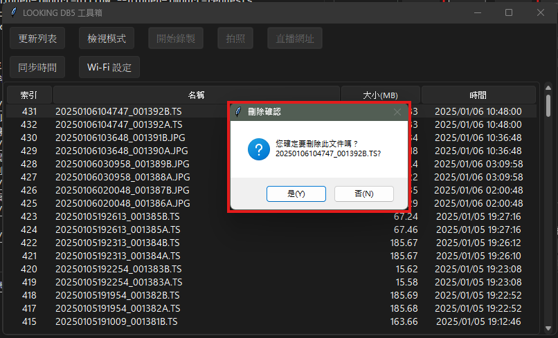

# Bob's Looking DB5 Toolbox
* 軟體還在開發中，目前代碼主要都為AI生成的還沒仔細清理，有Bug也請見諒囉  
* 本方案或許亦兼容部分聯詠科技(Novatek)解決方案的記錄器，以及使用Viidture或是相關軟體作為連結軟件的行車紀錄器方案，歡迎有興趣的開發者載下來測試！  
* 有另外開一個討論串在這裡：[Mobile01](https://www.mobile01.com/topicdetail.php?f=671&t=7046620&p=1#90902218)
## 已有功能
* 暫停/啟動錄製(機器自動錄製功能可以直接電腦上停用)
* 基礎檔案管理功能
* 切換錄影/播放模式
* 獲取預覽圖
* 與電腦時間校準功能
* Windows下改以微軟正黑體作為UI字體
## 使用方式
1. *請先連上機器的WiFi*
2. 啟動軟體需要在資料夾下輸入`python main.py`，按下 **停止錄製** 鈕停止目前機器上的自動錄製
   
3. 按下 **刷新** 可以更新目前的檔案清單
4. 就像檔案管理員一樣，點擊上方可以按照欄位排序檔案
   
5. 點兩下左鍵可以複製檔案的播放連結，可以複製到VLC或是Windows 11"媒體播放器"直接串流播放，貼到瀏覽器可以下載
   
6. 點擊右鍵可以砍檔案
   
7. 新版更新(暫時是英文版的，方便AI編輯)
   