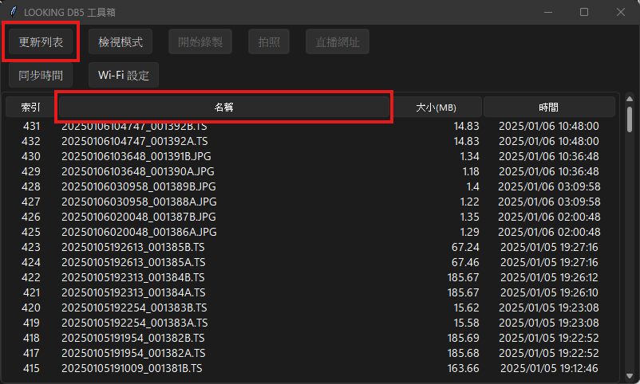
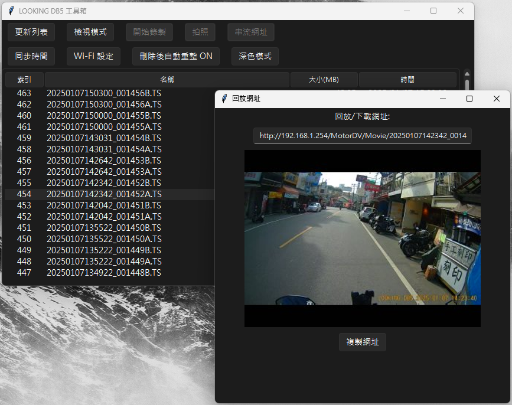

# Bob's Looking DB5 Toolbox
* 軟體還在開發中，目前代碼主要都為AI生成的還沒仔細清理，有Bug也請見諒囉  
* 本方案或許亦兼容部分聯詠科技(Novatek)解決方案的記錄器，以及使用Viidture或是相關軟體作為連結軟件的行車紀錄器方案，歡迎有興趣的開發者載下來測試！  
* 有另外開一個討論串在這裡：[Mobile01](https://www.mobile01.com/topicdetail.php?f=671&t=7046620&p=1#90902218)  
## 已有功能
* 暫停/啟動錄製(機器自動錄製功能可以直接電腦上停用)
* 基礎檔案管理功能
* 切換錄影/播放模式
* 獲取預覽圖
* 與電腦時間校準功能
* Windows下改以微軟正黑體作為UI字體
* 套用接近原生Windows的主題，改為深色UI(使用[rdbende/Sun-Valley-ttk-theme](https://github.com/rdbende/Sun-Valley-ttk-theme))
* 修改Wi-Fi功能
* 高解析度拍照功能
* 主題套用功能
## 前期準備(直接從源碼執行、需除錯時)
*  可以直接使用Release頁面下打包好的的執行檔案，執行會更便捷！
*  預計之後會準備Windows、Linux下的執行檔，macOS...我沒有鈔能力，所以可能需要有興趣的貢獻者幫忙了
1. 安裝必要的安裝包
   ```
   pip install requests pillow
   ```
2. 安裝修改過的sv_ttk函式庫[https://github.com/Bob-YsPan/Sun-Valley-ttk-theme-fallback-font](https://github.com/Bob-YsPan/Sun-Valley-ttk-theme-fallback-font)
   ```
   git clone https://github.com/Bob-YsPan/Sun-Valley-ttk-theme-fallback-font
   cd Sun-Valley-ttk-theme-fallback-font
   python setup.py build
   python setup.py install
   ```
3. 執行腳本
   ```
   python main.py
   ```
## 打包指令
*  因為相關機制有變動：[https://github.com/pyinstaller/pyinstaller/issues/7692](https://github.com/pyinstaller/pyinstaller/issues/7692)
*  如果打包不成功，且使用較舊版的Python(Windows)，可以嘗試安裝`pyinstaller==5.11`
*  如果Windows下打包為病毒，請使用`pyinstaller==5.13`或更低版本
*  打包指令如下：
   ```
   pyinstaller --hidden-import=pillow --hidden-import=requests --hidden-import=sv_ttk --onefile --noconsole --name=Bob_Looking_DB5_Toolbox ./main.py
   ```
## 使用方式
1. *請先連上機器的WiFi*
2. 啟動軟體需要在資料夾下輸入`python main.py`，按下 **停止錄製** 或是 **錄製模式(模式切換)** 鈕停止目前機器上的自動錄製
   
3. 按下 **更新列表** 可以更新目前的檔案清單
4. 就像檔案管理員一樣，點擊上方可以按照欄位排序檔案，使用名稱排序找到最新的檔案吧
   
5. 點兩下左鍵可以複製檔案的播放連結，可以複製到VLC、MPC-HC或是Windows 11"媒體播放器"直接串流播放，貼到瀏覽器可以下載  
     
   **注意！！切換成 檢視模式 時才可以載入預覽圖，韌體限制！**
   
6. 點擊右鍵可以砍檔案
   
7. 怕行車紀錄器預設密碼太好猜？使用Wi-Fi設定工具套用屬於自己的吧，記得依序按下套用跟重啟Wi-Fi來套用
   
8. 按下同步時間即可讓紀錄器時間與電腦同步，就不用連APP校時間了
   
10. 新版更新(最新版截圖優先更新在這裡)
   